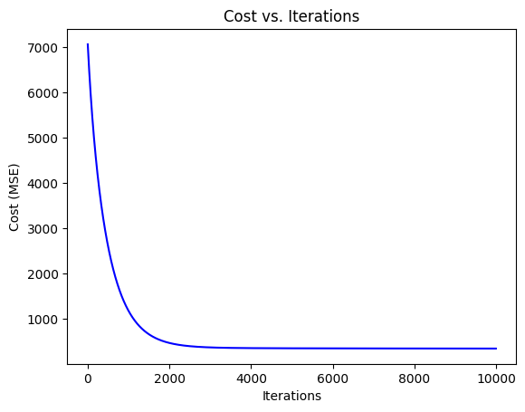
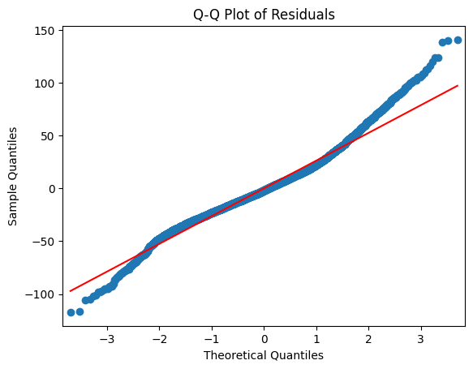
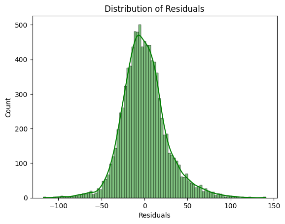
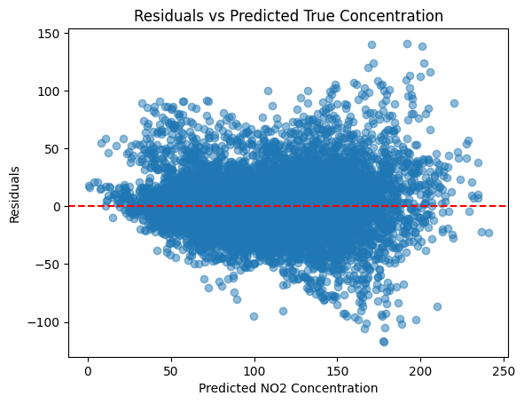

## Introduction to Polynomial Regression with Multiple Features: Vectorization, Scaling, and Feature Engineering (No Regularization)

**DATA**: [UC Irvine Air Quality Dataset](https://archive.ics.uci.edu/dataset/360/air+quality)

**Goal**: Estimating ambient NO₂ concentrations from low-cost sensors.

In this project I developed a multiple polynomial regression model to calibrate low-cost air-quality sensors by mapping their electrical signal in a natural environment to accurately estimate NO₂ concentrations. This approach addresses common challenges in low-cost sensing, including cross-sensitivity, environmental changes, and variable sensor behavior over time. 

### **Model Results**

**Scikit-learn Ridge Polynomial Regression** \
R²: 0.747 \
RMSE: 22.98 \
MAE: 17.06 \
AdjR²: 0.741

**Custom Polynomial Regression**  \
R²: 0.681 \
RMSE: 26.23 \
MAE: 19.63  \
AdjR²: 0.681

Our model achieved an $R^2$ score of 0.681, indicating that approximately 68% of the variance in measured NO₂ concentrations is explained by the model’s sensor and modeled features. Prediction errors are typically within ~20 µg/m³ of true NO₂ levels (Mean Absolute Error (MAE): 19.63 µg/m³), the higher RMSE (Root Mean Squared Error (RMSE): 26.23 µg/m³) reveals occasional larger errors. The similarity between the Adjusted $R^2$ and the standard $R^2$ suggests that the additional features included in the final model provide meaningful explanatory value relative to the model’s complexity.

For comparison, Scikit-learn’s ridge regression model achieved a slightly higher R² of 0.747 and a lower RMSE of 22.98 µg/m³, confirming the validity of our implementation. The scikit-learn model performs slightly better due to L2 regularization (Ridge), which penalizes large coefficients and improves generalization, particularly when many polynomial terms are present. In contrast, our model does not regularize, making it more sensitive to multicollinearity and noise. 

<table>
  <tr>
    <td align="center">
       
      <em>Figure 1. Cost decreases smoothly</em>
    </td>
    <td align="center">
       
      <em>Figure 2. Residuals mostly normal, slight tail deviation</em>
    </td>
  </tr>
  <tr>
    <td align="center">
       
      <em>Figure 3. Distribution of Residuals</em>
    </td>
    <td align="center">
       
      <em>Figure 4. Some heteroscedasticity</em>
    </td>
  </tr>
</table>

### **Data Processing Pipeline**

- **01_EDA_and_Data_Preprocessing**
- **02_Feature_Engineering**
- **03_Prediction**

## **Polynomial Regression**

> **Note**: GitHub mobile does **not** render LaTeX math formulas.  
> Please view this project on a **desktop browser**.

Recommended Reading: 
[Lecture 6: Multiple Linear Regression, Polynomial Regression and Model Selection](https://harvard-iacs.github.io/2018-CS109A/lectures/lecture-6/presentation/Lecture6_MR_ModelSelection.pdf)

Polynomial Regression extends Linear Regression to model nonlinear relationships between continuous variables by fitting a curve to the data.

A basic linear model:

$$
f(x) = wx + b
$$

Can be transformed by adding polynomial terms, such as squaring the original feature:

$$
f(x) = w_2 x^2 + w_1 x + b
$$

Transformations are not limited to $x^2$; it can include any polynomial terms that best fit the data, such as $x^3$, $\sqrt{x}$, $x^8$, etc. Each new term represents a basis function, meaning we derive new features from the original variables to better capture non-linear trends. [Read Feature Engineering](#feature-engineering)

Importantly, polynomial regression remains linear in its parameters (meaning the weights $w$ and bias $b$ are still to the first power). This means that we can safely reuse the same cost function, gradient computations, and gradient descent algorithm from linear regression, since optimization is still performed using least squares.

## **Multiple Regression**    

Multiple Regression extends linear and polynomial regression by allowing our target variable to depend on multiple input features, enabling the modeling of more complex relationships. For example, say we are given the model:

$$
y = w_1 x_1 + w_2 x_2^2 + w_3 x_3^3 + b
$$

Where we are now dealing with squared $x^2$ and cubic $x^3$ features as expressions of our target variable $y$. These new features represent more complex ways to see our data, that is, they provide key information that meaningfully contribute to the output.

Although having multiple features can help us obtain a more holistic expression of our target variable, it is important to note that before fitting the model, we must perform feature scaling to bring all variables within a similar range. Without scaling, large-magnitude features can distort the cost function’s shape, creating elongated contours that cause gradient descent to zigzag and converge slowly. [Read Feature Scaling](#feature-scaling)

### **Loops to Vectorization**

When we move from single-variable regression to multiple-variable regression, our mathematical expressions remain conceptually identical, but computationally we move from iterative operations (looping through each training example and feature) to matrix operations that can be executed in a single step. This process, called vectorization, placed our target variable $y$ and weights $w$ into a vector and our features into a matrix $X$.

For a dataset with m examples and n features, a single prediction becomes:

$$
f_{w,b}(x^{(i)}) = w^T x^{(i)} + b
$$

where:
- $x^{(i)} \in \mathbb{R}^n$ is the feature vector for the $i^{\text{th}}$ example
- $w \in \mathbb{R}^n$ is the weight vector  
- $b$ is the bias (scalar)

To handle all $m$ examples, stack into matrix $X$ and vectors $w$, $Y$:

$$
X =
\begin{bmatrix}
x_{11} & x_{12} & \dots & x_{1n} \\
x_{21} & x_{22} & \dots & x_{2n} \\
\vdots & \vdots & \ddots & \vdots \\
x_{m1} & x_{m2} & \dots & x_{mn}
\end{bmatrix}
\quad
w =
\begin{bmatrix}
w_1 \\
w_2 \\
\vdots \\
w_n
\end{bmatrix}
\quad
\hat{Y} =
\begin{bmatrix}
f_{w,b}(x^{(1)}) \\
f_{w,b}(x^{(2)}) \\
\vdots \\
f_{w,b}(x^{(m)})
\end{bmatrix}
$$

Then our predictions for all examples at once can be written as:

$$
\hat{Y} = Xw + b\mathbf{1}
$$
  
This equation replaces the need for nested loops over every training example and feature, where the operation $Xw$ represents matrix–vector multiplication and $b\mathbf{1}$ represents the bias term broadcasted to all $m$ examples.

### **Vectorized cost function**

Recall our least squares cost function:

$$
J(w, b) = \frac{1}{2m} \sum_{i=1}^{m} \big( f_{w,b}(x^{(i)}) - y^{(i)} \big)^2
$$

where

$$
f_{w,b}(x^{(i)}) = w^T x^{(i)} + b
$$

Using the [Euclidean (L2) norm](https://www.cs.utexas.edu/~flame/laff/alaff/chapter01-vector-2-norm.html), we can express this compactly as:

$$
J(w,b) = \frac{1}{2m} \|Xw + b\mathbf{1} - Y\|^2
$$

Or expanded:

$$
J(w,b) = \frac{1}{2m} (Xw + b\mathbf{1} - Y)^T (Xw + b\mathbf{1} - Y)
$$

This computes all errors simultaneously.

### **Gradient Descent**

Similarly, the gradient of J with respect to w and b can be written compactly as:

$$
\nabla_w J(w,b) = \frac{1}{m} X^T (Xw + b\mathbf{1} - Y)
$$

$$
\frac{\partial J(w,b)}{\partial b} = \frac{1}{m} \mathbf{1}^T (Xw + b\mathbf{1} - Y)
$$

The parameter updates become:

$$
w \leftarrow w - \alpha \nabla_w J(w,b)
$$

$$
b \leftarrow b - \alpha \frac{\partial J(w,b)}{\partial b}
$$

Each iteration updates all parameters via vectorized operations, making it efficient for large datasets. In practice, the learning rate 𝛼 is tuned experimentally, if it’s too large, the cost may diverge; if too small, convergence is slow. A good approach is to start small (e.g., 0.01) and monitor cost decay.

### **Closed-Form Solution for Least Squares in Vectorized Form (Normal Equation)**

The analytical solution for the parameters (including bias if incorporated) that minimizes J (without iteration) is given by the Normal Equation:

$$
θ = (X^{T} X)^{-1} X^{T} Y
$$

Here, θ includes both $w$ and $b$. I recommend the following reading that goes over this formulation completely: [5.4 - A Matrix Formulation of the Multiple Regression Model](https://online.stat.psu.edu/stat462/node/132/) 

### **Feature Scaling**

In most real-world datasets, feature magnitudes vary widely across variables.

We are given sensor outputs:

| Index | PT08.S1(CO) | PT08.S2(NMHC) | PT08.S3(NOx) | PT08.S4(NO2) | PT08.S5(O3) | T    | RH       | AH       | NO2(GT) |
|-------|-------------|---------------|--------------|--------------|-------------|------|----------|----------|---------|
| 0     | 1360.00     | 1045.50       | 1056.25      | 1692.00      | 1267.50     | 13.60| 48.875001| 0.757754 | 113.0   |
| 1     | 1292.25     | 954.75        | 1173.75      | 1558.75      | 972.25      | 13.30| 47.700000| 0.725487 | 92.0    |

Although these seem reasonable, if we train our model directly on them without scaling, gradient descent takes tiny steps in high-magnitude directions and large steps in low-magnitude ones, leading to slow, oscillatory convergence.

To prevent features with larger magnitudes from dominating the model, we **standardize** each column feature using one of two normalization methods.

In **Z-Score Normalization**, each feature value is transformed by subtracting the feature’s mean and dividing by its standard deviation:

$$
x_n \leftarrow \frac{x_n - \mu_n}{\sigma_n}
$$

In **Mean Normalization**, each feature value is transformed by subtracting the mean and dividing by the range (the difference between the maximum and minimum values):

$$
x_n \leftarrow \frac{x_n - \mu_n}{\max(x_n) - \min(x_n)}
$$

Here, $x_n$ represents the individual values in features such as PT08.S1(CO)

After standardization, our new variables become: 

| Index | PT08.S1(CO) | PT08.S2(NMHC) | PT08.S3(NOx) | PT08.S4(NO2) | PT08.S5(O3) | T        | RH       | AH       | NO2(GT) |
|-------|-------------|---------------|--------------|--------------|-------------|----------|----------|----------|---------|
| 0     | 1.178180    | 0.386336      | 0.874538     | 0.695918     | 0.581269    | -0.527421| -0.018272| -0.651117| 113.0   |
| 1     | 0.867671    | 0.047528      | 1.334069     | 0.307641     | -0.148787   | -0.561582| -0.086613| -0.731345| 92.0    |

which now have comparable ranges and ensure that each feature contributes equally to model training.

Note: We do not scale our target variable $Y$. 

### **Feature Engineering**

Feature engineering involves applying transformations directly to your dataset to create new input variables or modify existing ones in ways that expose deeper patterns. In polynomial regression, this often means adding higher-order terms such as $x^2, x^3$ or interaction terms such as $x_1 x_2$ that allow the linear model to fit nonlinear patterns. Transformations such as $\log(x)$, $\sqrt{x}$, or $\frac{1}{x}$ can also be applied to linearize relationships. While these techniques can greatly improve model flexibility, they also increase dimensionality and risk of overfitting, so they are often paired with regularization to maintain generalization.

Before feature engineering (original features only):

| Index | PT08.S1(CO) | PT08.S2(NMHC) | PT08.S3(NOx) | PT08.S4(NO2) | PT08.S5(O3) | T    | RH       | AH       | NO2(GT) |
|-------|-------------|---------------|--------------|--------------|-------------|------|----------|----------|---------|
| 0     | 1360.00     | 1045.50       | 1056.25      | 1692.00      | 1267.50     | 13.60| 48.875001| 0.757754 | 113.0   |
| 1     | 1292.25     | 954.75        | 1173.75      | 1558.75      | 972.25      | 13.30| 47.700000| 0.725487 | 92.0    |

After feature engineering (original + new terms):

| Index | PT08.S1(CO) | PT08.S2(NMHC) | PT08.S3(NOx) | PT08.S4(NO2) | PT08.S5(O3) | T    | RH       | AH       | NO2(GT) |
|-------|-------------|---------------|--------------|--------------|-------------|------|----------|----------|---------|
| 0     | 1360.00     | 1045.50       | 1056.25      | 1692.00      | 1267.50     | 13.60| 48.875001| 0.757754 | 113.0   |
| 1     | 1292.25     | 954.75        | 1173.75      | 1558.75      | 972.25      | 13.30| 47.700000| 0.725487 | 92.0    |

| Index | PT08.S3(NOx)_sq | T_sq      | AH_log   | T_RH       | PT08.S3(NOx)_log |
|-------|-----------------|-----------|----------|------------|------------------|
| 0     | 1.115664e+06    | 184.96    | -0.277384| 664.70     | 6.963426         |
| 1     | 1.377689e+06    | 176.89    | -0.320898| 634.41     | 7.068811         |

### **Regularization**

Regularization penalizes model complexity by adding a term to the loss function that discourages large coefficient values. While this project does not implement regularization, it remains important for preventing polynomial models from overfitting.

Overfitting occurs when a model performs extremely well on training data but poorly on unseen data, a common issue with high-degree polynomials. Regularization mitigates this by constraining model complexity.

A good reading on vectorization and regularization: [Linear Regression: Vectorization, Regularization](https://courses.cs.washington.edu/courses/cse446/20wi/Lecture8/08_Regularization.pdf)

